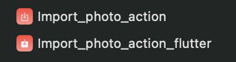

# golden_ios_extensions

A new Flutter project demonstrating various different iOS Extensions inside of a Flutter application.

## Table of extensions

An overview over all extensions can be seen [here!](https://developer.apple.com/app-extensions/)

| Extension Point                  | Description                                                                                          | Implemented | Comments |
|----------------------------------|------------------------------------------------------------------------------------------------------|-------------|----------|
| Action                           | Add custom actions to the share sheet to invoke your app’s functionality from any app.               | ✅         |  Actually 2 versions are implemented one using a storyboard and another one using a custom Flutter view         |
| Audio Unit                       | Create and modify audio in any app that uses sound, including music production apps such as GarageBand or Logic Pro X. | ❌         |          |
| Authentication Services          | Streamline authentication for users by enabling single sign-on.                                      | ❌         |          |
| AutoFill Credential Provider     | Surface credentials from your app in Password Autofill and pull your app’s password data into the Password AutoFill workflow. | ❌         |          |
| Broadcast Setup UI / Broadcast UI| Capture the contents of a user’s screen to stream to a video broadcast service.                      | ❌         |          |
| Call Directory                   | Display caller identification from your appʼs custom contact list so users know who’s calling.       | ❌         |          |
| ClassKit Content Provider        | Update the status of your appʼs activities so that status is visible in the Schoolwork app.         | ❌         |          |
| Content Blocker                  | Provide rules for hiding elements, blocking loads, and stripping cookies from Safari requests.      | ❌         |          |
| File Provider                    | Let other apps access the documents and directories stored and managed by your app.                 | ❌         |          |
| Intents                          | Let users interact with your app using Siri.                                                        | ❌         |          |
| Intents UI                       | Customize the interface for interactions with your app in Siri conversations or Maps.               | ❌         |          |
| Location Push Service            | Enables a location sharing app, with a user’s authorization, to query a user’s location in response to a push from Apple Push Notification service (APNs). | ❌         |          |
| Mail                             | Enhance Mail by adding custom actions, blocking content, signing and encoding messages, and more.   | ❌         |          |
| Message Filter                   | Identify and filter unwanted SMS and MMS messages.                                                  | ❌         |          |
| Network                          | Provide system-level networking services such as VPN, proxies, or content filtering.                | ❌         |          |
| Notification Center              | Customize the appearance of your app’s notification alerts.                                         | ❌         |          |
| Notification Service             | Modify the payload of a remote notification before it’s displayed on the user’s device.             | ❌         |          |
| Persistent Token                 | Grant access to user accounts and the keychain using a token.                                       | ❌         |          |
| Photo Editing                    | Allow your app to edit assets directly within the Photos app.                                       | ❌         |          |
| Quick Look Preview               | Provide previews of documents your app owns so they can be viewed in any app.                       | ❌         |          |
| Share                            | Let users post to your social-network service from any app.                                         | ✅          | Currently only using UIKit         |
| Spotlight Import                 | Make content in your app searchable in Spotlight, Safari, Siri, and more.                          | ❌         |          |
| Sticker Pack                     | Add custom stickers to Messages.                                                                    | ❌         |          |
| Thumbnail                        | Display thumbnails of your custom document types in all apps.                                       | ❌         |          |
| Virtual Conference               | Integrate your video conferencing service directly into events on user’s calendars.                 | ❌         |          |
| Widgets                          | Show relevant, glanceable content from your app on the iOS Home Screen and Lock Screen, macOS Notification Center, and as complications in watchOS. | ❌         |          |
